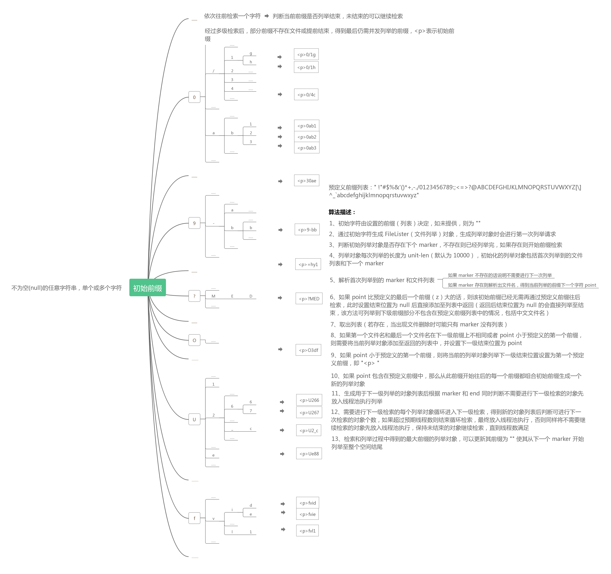

# 数据源输入

## 简介
从支持的数据源中读入资源信息列表，部分数据源需要指定行解析方式或所需格式分隔符，读取指定位置的字段作为输入值进行下一步处理。**目前支持的数据源类型分为
几大类型：云存储列举(list)、文件内容读取(file)**。  

## 配置文件选项
通过 **source=** 或者 **path=** 来指定具体的数据源地址，例如:  
`source=qiniu` 表示从七牛存储空间列举出资源列表，配置文件示例可参考 [配置模板](../templates/qiniu.config)  
`source=local` 表示从本地文件按行读取资源列表，配置文件示例可参考 [配置模板](../templates/local.config)  
**在 v2.11 以上版本，取消了设置 source 参数的强制性，如果不显式指定则根据 path 参数来自动判断：  
`path=qiniu://<bucket>` 表示从七牛存储空间列举出资源列表  
`path=tencent://<bucket>` 表示从腾讯存储空间列举出资源列表  
`path=../<file-path>` 表示从本地文件中读取资源列表  
当无 source 和 path 路径进行判断时则默认认为从七牛空间进行列举**  

### 1 公共参数
```
source=qiniu/tencent/aliyun/local
path=
indexes=key,hash,fsize
unit-len=10000
threads=30
```  
|参数名|参数值及类型 |含义|  
|-----|-------|-----|  
|source| 字符串 qiniu/tencent/local | 选择从[云存储空间列举]还是从[本地路径文件中读取]资源列表|  
|path| 输入源路径字符串| 资源列表路径，本地数据源时填写本地文件或者目录路径，云存储数据源时可填写"qiniu://\<bucket\>"、"tencent://\<bucket\>" 等|  
|indexes| 字符串列表| 资源元信息字段索引（下标），设置输入行对应的元信息字段下标|  
|unit-len| 整型数字| 表示一次读取的文件个数（读取或列举长度，默认值 10000），对应与读取文件时每次处理的行数或者列举请求时设置的 limit 参数|  
|threads| 整型数| 表示预期最大线程数，若实际得到的文件数或列举前缀数小于该值时以实际数目为准|  

#### # 关于文件信息字段和 indexes 索引
文件信息字段及顺序定义为：**key,hash,fsize,putTime,mimeType,type,status,md5,endUser**，indexes 指输入行中包含的资源信息字段的索引值，
索引值的顺序对应上述文件信息字段顺序，即文件信息字段和 indexes 索引字段均默认使用七牛存储文件的字段进行定义，顺序固定，其释义及其他数据源方式对
应关系如下：  

|字段名|数据类型及含义 |腾讯云存储资源字段对应关系| 输入行字段对应关系|  
|-----|------------|---------------------|---------------|  
|key| 字符串，文件名| key| indexes 的第1个索引|  
|hash| 字符串，文件哈希值| etag| indexes 的第2个索引|  
|fsize| 长整型数字，文件大小，单位 kb| size| indexes 的第3个索引|  
|putTime| 长整型数字，时间戳数字| lastModified| indexes 的第4个索引|  
|mimeType| 字符串，mime 类型，也即 content-type| 无此含义字段| indexes 的第5个索引|  
|type| 整形数字或者字符串，资源存储类型| storageClass（字符串）| indexes 的第6个索引|  
|status| 整形数字，资源访问状态| 无此含义字段| indexes 的第7个索引|  
|md5| 字符串，文件 md5 值| 无| indexes 的第8个索引|  
|endUser| 字符串，文件终端标识符| Owner-displayName| indexes 的第9个索引|  

**默认情况：**  
（1）当数据源为 [file](#2-file-文件内容读取) 类型时，默认情况下，程序只从输入行中读取 key 字段数据，parse=tab/csv 时索引为 0，parse=json
时索引为 "key"，需要指定更多字段时可设置为数字列表:0,1,2,3,... 或者 json 的 key 名称列表，长度不超过 9，长度表明取对应顺序的前几个字段，当
parse=tab 时索引必须均为整数，如果输入行中本身只包含部分字段，则可以在缺少字段的顺序位置用 -1 索引表示，表示跳过该顺序对应的字段，例如原输入行中不
包含 mimeType 和 type 字段，则可以设置 indexes=0,1,2,3,-1,-1,6。  
（2）当数据源为 [list](#3-list-云存储列举) 类型时，也可以设置该参数，用于指定下一步 process 操作所需要的字段，默认情况下包含 key 的下标，如果
存在 process 操作则自动保留 key 字段或者根据过滤条件的字段进行添加，否则包含全部下标：key,hash,fsize,putTime,mimeType,type,status,md5,
endUser，如自行设置字段应为为这其中的一个或几个（因为必须和对象的变量名称一致），需要跳过的字段设置为 -1 即可，按照顺序依次解析所有字段。  

### 2 file 文件内容读取
```
parse=tab/json
separator=\t
# 文件内容读取资源列表时一般可能需要设置 indexes 参数（默认只包含 key 字段的解析）
indexes=
rm-keyPrefix=
```
|参数名|参数值及类型 |含义|  
|-----|-------|-----|  
|parse| 字符串 json/tab/csv| 数据行格式，json 表示使用 json 解析，tab 表示使用分隔符（默认 "\t"）分割解析，csv 表示使用 "," 分割解析|  
|separator| 字符串| 当 parse=tab 时，可另行指定该参数为格式分隔符来分析字段|  
|rm-keyPrefix| 字符串|将解析出的 key 字段去除指定前缀再进行后续操作，用于输入 key 可能比实际空间的 key 多了前缀的情况，如输入行中的文件名多了 "/" 前缀|  

### 3 list 云存储列举  
```
<密钥配置>
region=
bucket=
marker=
start=
end=
prefixes=
anti-prefixes=
prefix-left=
prefix-right=
```  
支持从不同的云存储上列举出空间文件，默认线程数(threads 参数)为 30，1 亿以内文件可以不增加线程，公共参数修改参考[公共参数配置](#1-公共参数)，通常
云存储空间列举的必须参数包括密钥、空间名(通过 path 或 bucket 设置)及空间所在区域(通过 region 设置)：  

|list 源|             密钥和 region 字段         |                  对应关系和描述               |  
|------|---------------------------------------|---------------------------------------------|  
|qiniu|`ak=`<br>`sk=`<br>`region=z0/z1/z2/...`|密钥对应七牛云账号的 AccessKey 和 SecretKey<br>region(可不设置)使用简称，参考[七牛 Region](https://developer.qiniu.com/kodo/manual/1671/region-endpoint)|  
|tencent|`ten-id=`<br>`ten-secret=`<br>`region=ap-beijing/...`| 密钥对应腾讯云账号的 SecretId 和 SecretKey<br>region(必须设置)使用简称，参考[腾讯 Region](https://cloud.tencent.com/document/product/436/6224)|  
|aliyun|`ali-id=`<br>`ali-secret=`<br>`region=oss-cn-hangzhou/...`| 密钥对应阿里云账号的 AccessKeyId 和 AccessKeySecret<br>region(必须设置)使用简称，参考[阿里 Region](https://help.aliyun.com/document_detail/31837.html)|  

|参数名|参数值及类型 |含义|  
|-----|-------|-----|  
|<密钥配置>|字符串|密钥对字符串|  
|region|字符串|存储区域|
|bucket|字符串| 需要列举的空间名称，通过 "path=qiniu://<bucket>" 来设置的话此参数可不设置，设置则会覆盖 path 中指定的 bucket 值|  
|threads| 整型数字| 表示并发列举时使用的线程数（默认 30）|  
|unit-len| 整型数字| 表示每次列举请求列举的文件个数（列举长度，默认值 10000）|  
|prefixes| 字符串| 表示只列举某些文件名前缀的资源，，支持以 `,` 分隔的列表，如果需要表示 "," 作为前缀的话需要加双转义符表示为 "\\,"|  
|prefix-config| 字符串| 该选项用于设置列举前缀的[配置文件](#prefix-config-配置)路径，配置文件格式为 json|
|anti-prefixes| 字符串| 表示列举时排除某些文件名前缀的资源，支持以 `,` 分隔的列表，"," 同样需要双转义符|  
|prefix-left| true/false| 当设置多个前缀时，可选择是否列举所有前缀 ASCII 顺序之前的文件|  
|prefix-right| true/false| 当设置多个前缀时，可选择是否列举所有前缀 ASCII 顺序之后的文件|  

#### # 关于多前缀列举
prefixes 或 prefix-config 用于设置多个 <prefix> 分别列举这些前缀下的文件，如指定多个前缀：[a,c,d]，则会分别列举到这三个前缀下的文件，如果设
置 prefix-config 则 prefixes 配置无效，同时 prefix-config 支持指定列举起始和结束位置(<start/marker>、<end>)，写法如下，配置举例见
[prefix-config 配置](../resources/prefixes.json)。在使用多个前缀列举的同时，可能存在需要列举到**第一个前缀之前**或**最后一个前缀之后**(前
缀会自动按照 ASCII 码排序)的文件，因此设置 prefix-left 和 prefix-right 用于满足该需求。  

##### prefix-config 配置
```
{
  "a":{
    "marker":"",
    "start":"",
    "end":""
  },
  "b":{
    "marker":"",
    "start":"",
    "end":""
  }
}
```  
|选项|含义|  
|-----|-----|  
|key|上述配置文件中的 "a"、"b" 为前缀，设置为 json key，key 不可重复，重复情况下后者会覆盖前者|  
|marker| 从指定 marker 的位置开始列举，该参数与 start 参数含义相同，同时设置时忽略 start 而使用 marker|  
|start| 从指定文件名开始列举，该参数必须是正确且存在的文件名，否则会产生错误的 marker 从而无法列举|  
|end| 文件名字符串，可以是完整的文件名，也可以是文件名前缀，程序列举时会以该文件信息作为结束位置|  

#### # 关于并发处理  
```
(1) 云存储数据源，从存储空间中列举文件，可多线程并发列举，用于支持大量文件的加速列举，线程数在配置文件中指定，自动按照线程数检索前缀并执行并发列举。  
(2) 本地文件数据源，从本地读取路径下的所有 .txt 文件，一个文件进入一个线程处理，最大线程数由配置文件指定，与输入文件数之间小的值作为并发数。    
```  

##### 并发列举
**1、并发处理效果依赖机器性能，由于处理时会启动大量线程且会同时读取大量的数据列表在内存中，因此会占用较大的内存，建议在配置高于 8C16G 的机器上运行，列
举效率更高，程序默认线程数为 30，可以参考机器性能适当提高，通常可以设置1-3百个线程，8C32G 的机器最好不要超过 200 线程，32C96G 的机器可以到 600
线程甚至更高。unit-len 一般不需要调整（默认值为 10000，列举腾讯、阿里等存储的空间文件时默认值为支持的 maxKeys），如果增加 unit-len 的话，建议
设置的线程数参考可能的最大线程数相应减小，例如设置 unit-len=20000 的话建议线程数参考最大值减半。**  

2、大量文件时建议：threads=200，文件数目较少时不建议使用较多线程，500 万以内文件数建议 threads<=100，100 万左右及以下的文件数建议线程数少于50
  或使用默认线程数 30，10 万及以下文件数可使用单线程直接列举，设置 threads=1，文件数较少时若设置并发线程数偏多则会增加额外耗时。在设置多个前缀时，
  线程数建议不要超过 200，因为每个前缀都会尝试按照线程数去并发，线程数过高经过多个指定前缀的递进容易造成内存崩溃。  

3、算法描述：使用前缀索引为每一个前缀 (第一级默认为连贯的 ASCII 常见字符) 创建一个列举对象，每个列举对象可以列举直到结束，在获取多个有效的列举对象
  之后，分别加入起始（无前缀，但到第一个前缀结束）列举对象和修改终止对象的前缀，随即开始并发执行列举，分别对输出结果进行后续处理。前缀索引个数和起始与
  终止列举对象的前缀会随自定义参数 prefixes/prefix-config 和 anti-prefixes 而改变，前者为指定列举的公共前缀，anti-prefixes 表示从所有列
  举操作中排除包含该前缀的情况，通常 prefixes 和 anti-prefixes 不同时进行设置。  
  <details><summary>并发列举算法描述图：点击查看</summary>  
  
  </details>  

4、列举线程数根据实际文件数量调整，通常线程数较多的情况下并发效果较好，列举速度较快，原因是并发列举之前需要分析空间文件的前缀，线程数多增递进到的前缀
  更多，则各线程需要列举的文件数量相对平均，达到比较好的并发效果。如果出现某些前缀的文件特别多的情况，则可能出现线程池中大部分线程列举完成了最后还在
  列举少量前缀的文件，理论上可能会出现在后期列举速度变慢的情况，或者由于公共前缀部分字符串较长，则可能导致计算线程期间列举出来的文件数量无变化（呈现
  卡住状态，实际是由于计算列举对象时间较长导致），但是整体加速效果还是非常明显的。  
  

## 命令行方式
```
-source= -path= threads= -unit-len= [-<name>=<value>]...
```
